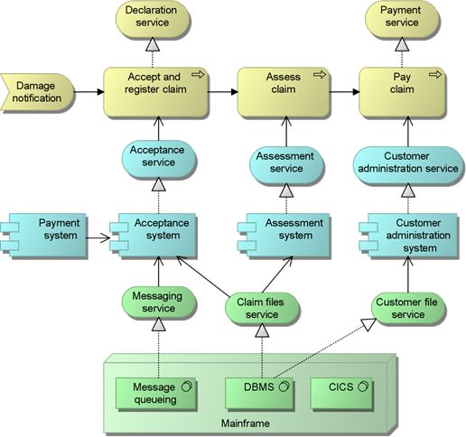

# Technique: Archimate

ArchiMate is *"an open and independent modeling language for Enterprise Architecture"* [[1]](#references).
Proposed and maintained by the Open Group, ArchiMate is a modeling language intended to enable Business and Technical Analysts to reach cross-layer understanding of larger-scale projects.
This cross-layer understanding is fundamental to ArchiMate and will be explored further in the following chapters. ArchiMate has mature tooling in the modelling software "Archi" [[2]](#references) which can be used to implement the ideas in the next chapters.

## References

1: [ArchiMate](https://www.opengroup.org/archimate-forum/archimate-overview)

2: [Archi](https://www.archimatetool.com/)

3: [Image by Marc Lankhorst](https://commons.wikimedia.org/wiki/File:ArchiMate_example.jpg)
