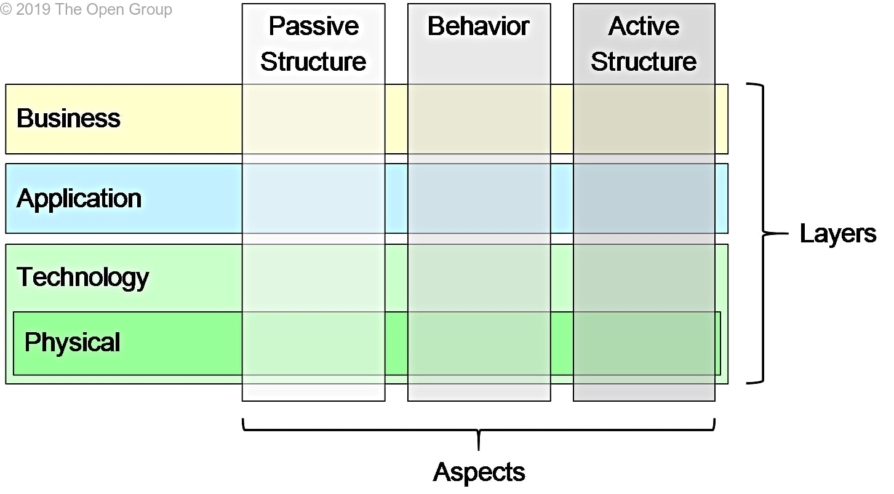
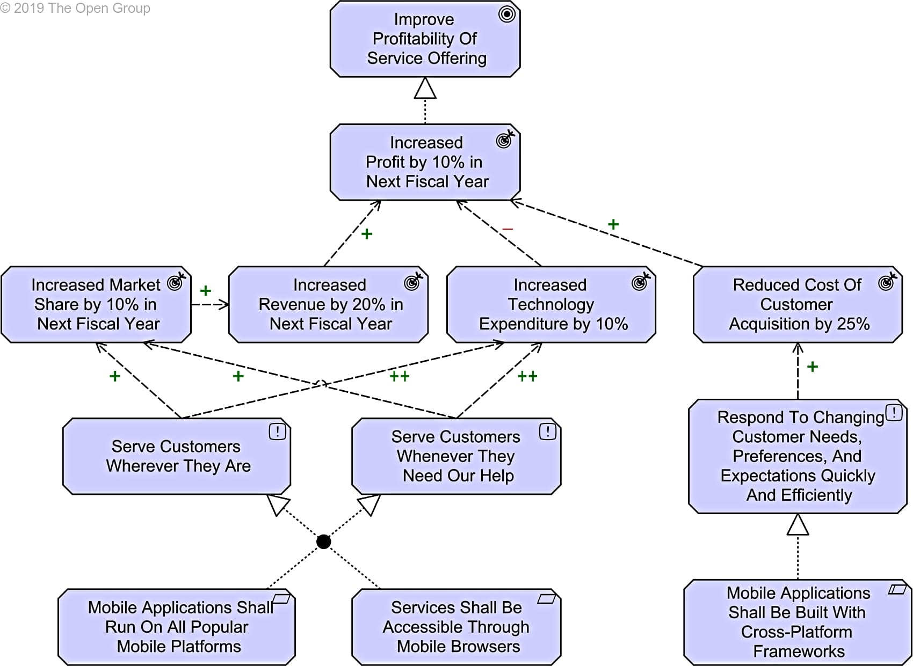
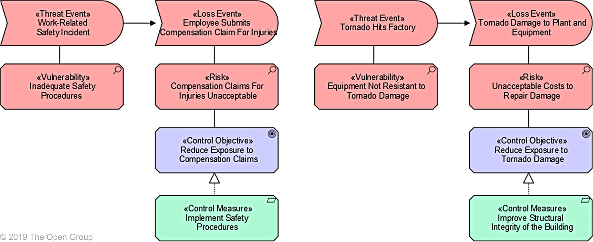
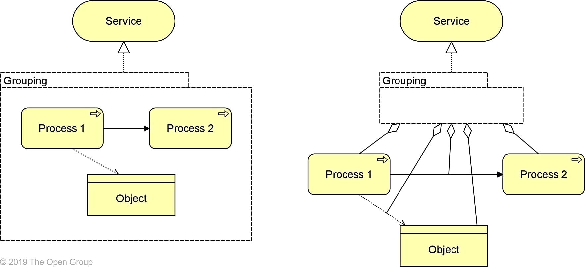

# Basics

The intention of this chapter is not to give a complete introduction to ArchiMate. It is assumed that at least some background is already present. If this is not the case, please refer to the ArchiMate specification for more information. [\[1\]](basics.md#references) Instead, this chapter will highlight the core concepts and notations used in Archimate that are of interest to be extended for threat modeling.

## Layers

One of the most distinctive elements of the Archimate notation is its clear separation into different layers that can be easily mapped onto TOGAF [[2]](#references) or Zachman [[3]](#references) layers. There are 3 main layers: the business, application, and technology layers. Again, one of he main goals of Archimate is a common language between different kinds of stakeholders in the business and IT systems within an organization. [\[4\]](basics.md#references)

For architectural threat modelling, this is an excellent starting point. Since the architectural layer encompasses the SABSA conceptual and logical layers, architectural threat modeling's responsibilities map quite naturally onto the business and application layers. However, architectural threat modelling also needs some understanding of the underlying technology to understand how certain threats might manifest themselves.

## Motivation Elements

Motivation elements enable architects to model elements related to goals, outcomes, principles and requirements. Being able to communicate intention and current information not related to the practical modeling of components is crucial for certain use-cases. This provides the context that allows for showing complex requirements on ArchiMate models related to the underlying components. This will be especially relevant for risk management (and threat modeling) since this often is focused on core concepts surrounding requirements and security objectives to supplement the components.

## Extendability

Another important concept of ArchiMate is its ability to be extended with specializations. In essence, a specialization of the core ArchiMate framework is one where certain concepts are "specialized" into more applicable ones. The specialized concepts copies all properties of the parent concept. This allows for reuse of the core Archimate specification in contexts that need a bit more refinement than its general purpose layer. A good example of this is the ArchiMate "Risk & Security Overlay" which will be extensively covered in the next sections. [\[5\]](basics.md#references)

## Grouping

The final concept of interest is the idea of groups. An ArchiMate group "aggregates or composes concepts that belong together based on some common characteristic". [\[6\]](basics.md#references) This is of special interest for security modelling because it maps closely to the idea of a "security domain". In a security domain, components are grouped with similar security requirements and permissions. There's 2 ways to use grouping in this context, either the initial groups of the busines view are re-used; these map quite naturally to security domains since they tend to denote components that work together in the same business context which have similar risk properties. Or, the second way, let the security architect define specialized security domains in a different view. This is more interesting later in the threat modelling cycle with a very refined model to build a security strategy. Do note that this has implications for threat modeling in zero-trust [\[7\]](basics.md#references) architectures where security domains tend to be defined as the components themselves instead of a collection of components.

## References

1: [TOGAF](https://www.opengroup.org/togaf)

2: [Zachman](https://www.zachman.com/images/ZI_PIcs/ZF3.0.jpg)

3: [ArchiMate Specification](https://pubs.opengroup.org/architecture/archimate3-doc/toc.html)

4: [ArchiMate Objective](https://pubs.opengroup.org/architecture/archimate3-doc/chap01.html#\_Toc10045267)

5: [Modeling Enterprise Risk Management and Security with the ArchiMate® Language](https://researchportal.unamur.be/en/publications/modeling-enterprise-risk-management-and-security-with-the-archima)

6: [Grouping in ArchiMate](https://pubs.opengroup.org/architecture/archimate3-doc/chap04.html#\_Toc10045308)

7: [Zero trust security model](https://en.wikipedia.org/wiki/Zero\_trust\_security\_model)

8: [Layering image](https://pubs.opengroup.org/architecture/archimate3-doc/chap03.html)

9: [Motivation example image](https://pubs.opengroup.org/architecture/archimate3-doc/chap06.html)

10: [Specialization example image](https://pubs.opengroup.org/architecture/archimate3-doc/chap15.html)

11: [Grouping example image](https://pubs.opengroup.org/architecture/archimate3-doc/chap04.html)
