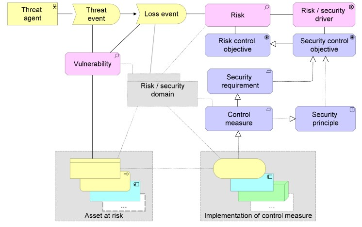

# Meta-Model

## ArchiMate Risk and Security Overlay Meta-Model

To conclude this chapter, above is a copy of the ArchiMate Risk and Security Overlay Meta-Model.
It's a useful reference tool for when unsure as to how certain components interact with each other or on how to model them.

## References
1: [Modeling Enterprise Risk Management and Security with the ArchiMate® Language](https://researchportal.unamur.be/en/publications/modeling-enterprise-risk-management-and-security-with-the-archima)
