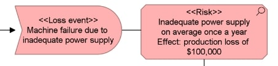
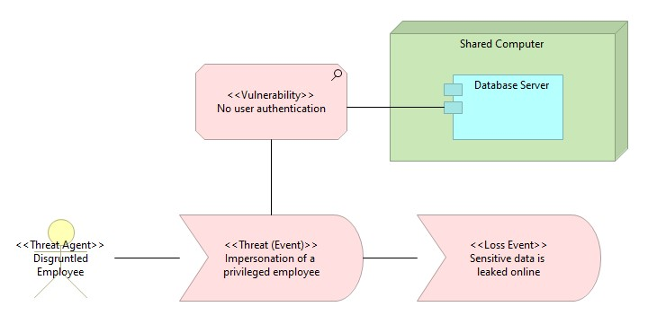

# Risk and Security Overlay

The ArchiMate standard explicitly defined itself to be extensible. 
One of the main building blocks to support this goal is the ability for individuals to develop ArchiMate "overlays"; 
extended specifications of ArchiMate using basic ArchiMate building blocks to allow for more expressiveness.
An example of such an overlay is especially important for threat modeling: the ArchiMate risk and security overlay. [[1]](#references)

This chapter will outline the theoretical foundation, main building blocks as well as practical examples of the overlay.
In what follows we will introduce each individual risk management concept and how it is mapped to the ArchiMate standard. Note: this entire sub-chapter includes definitions and concepts directly from the risk and security overlay whitepaper. However, this white paper was written about risk management at a higher level, not specifically cyber security threat modelling. We will therefore focus more on the relevant components.
See table for more definitions.

## Mapping Risk and Security concepts to ArchiMate

**These definitions and mappings are near identical copies (including language)** of those found in the whitepaper. Sometimes slightly adjusted or amended to focus more on threat modelling instead of risk management. Note many of the mappings can be done through specialization.

### Risk

Mapping the concept of **risk** in ArchiMate can be done with the _assessment_ concept, for example through specialization. 
In a threat model however, risk itself is not commonly modelled. What is far more useful is to model individual threats, control measures, etc.
**Risk metrics** should be included as _attributes_ to the risk concept.
Finally, a **loss event** (the event that the risk considers) can be mapped to the _business event_ concept.

### Threat
The general notion of a **threat** can be modelled as an ArchiMate _driver_, however since threat is an ambiguous term, more specific notions of threat are used to more precisely model threats.
The term **Threat Agent** refers to the above entity capable of causing harm. There exist _various active structure_ ArchiMate elements that could be used to model threat agents. In practice, _business actor_ elements are commonly used. In contrast to threat agent, a **Threat Event** refers to the actual event that may cause harm. 
Similar to threat agents, threat events can be naturally mapped as a specialization to the _business event_ element. 
"Threat Event" in the overlay is what is most commonly referred to as an actual "threat", both terms can be used in modelling for describing this concept. 

_**Note:**_ When we talk about an _attack_ this is a specific type of threat event that is the result of an _attacker's_ (a specific kind of threat agent) intentional malicious activity.

#### Asset at risk

Anything (tangible or intangible) capable of being owned or controlled to produce value can be referred to as an **asset at risk**. In cyber security contexts, this can an data, device, or other component of the environment that supports information-related activities. Mapping assets can be done with _most or a combination of core elements_ in the ArchiMate specification. A specific "asset" profile could be assigned to the elements, this profile could then have attributes important to to the asset such as its value. In the last example, the database server could be an asset at risk.

#### Vulnerability

A **vulnerability** within cyber security contexts can be defined as a weakness that allows an attacker to threaten the value of an asset. An _assessment_ can be used to model these, either by seeing a vulnerability as a specialization of an assessment or as a specific attribute. However typically vulnerabilities aren't modelled themselves. In an architectural model, known vulnerabilities should be scarce. The focus should lie on threats.

### Domain

A **domain** is a set of related entities that share one or more characteristics and defines the semantic of a specific field. A couple of specific domains will be defined further down. Domains can be mapped to the ArchiMate grouping element.

A **security domain** groups assets with the same security level that fall under the jurisdiction of one security policy.

A **risk management domain** is a group

**Mitigation domains** group together assets amd actions that together mitigate risk in one or more risk management domains. Risk and mitigation domains are concepts more closely associated with risk management than threat modelling.

_**Note:**_ In practice defining a security domain is tricky. Recently trends such as zero-trust and defense-in-depth have only made it even more important to be very clear on your own... In general applying domains at the abstract and defining yourself.... Because of this we included a short chapter which explores how this can be done in practice.

### Controls

**Risk Control**, **Treatment**, **Mitigation** are the deployment of a set of security services to protect against a security threat. Reducing a threat, a vulnerability or an attack by eliminating or preventing it, by minimizing the harm it can cause, or by discovering and reporting it so other action can be taken. Depending on the kind of action, nearly _any core element or combination_ thereof can be used to model it. A grouping can also be used to form a control of several different sub-components.

_**TODO: Add picture of examples + maybe a grouping**_

#### Control Requirement

A formalized need to be fulfilled by means of a control in order to face an identified threat.

**TODO: add requirements more in general?**

#### Policy

## References