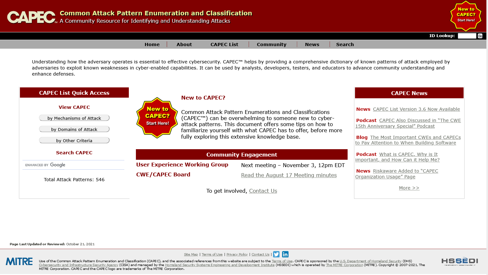
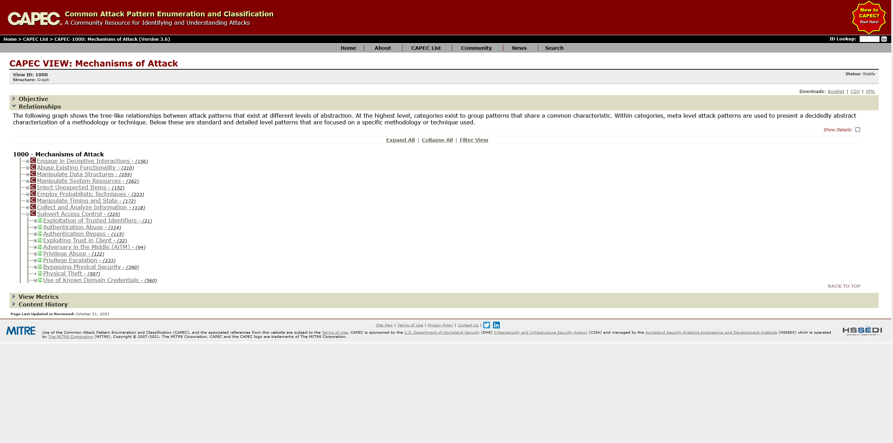
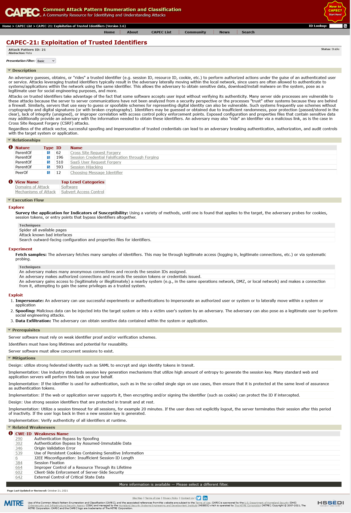
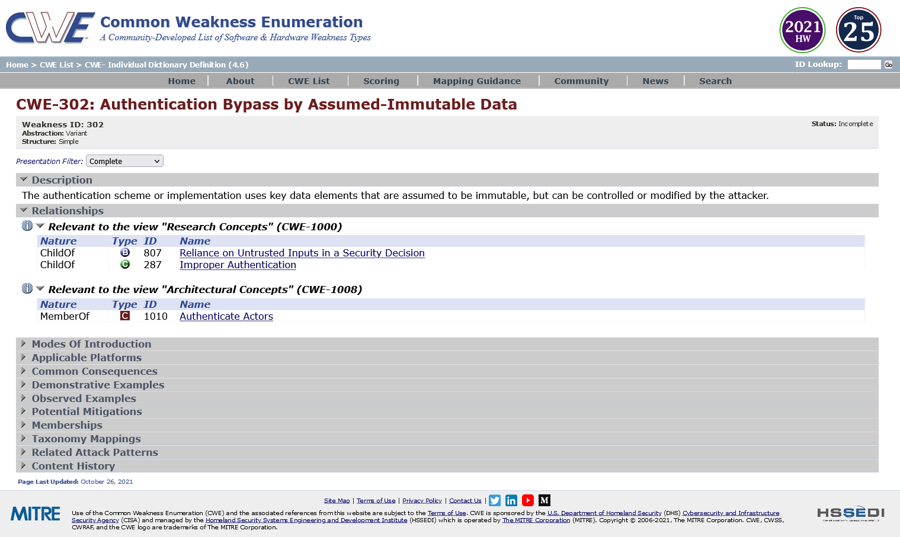

# CAPEC CAWE CWE

## Traversing CAPEC
The first step to using this methodology consists of going to the CAPEC website found at [capec.mitre.org](https://capec.mitre.org/). The starting page should look something like the following:

There are currently 2 main "views" within CAPEC: mechanisms of attack or domains of attack.
These can be found on the left side, under "CAPEC List Quick Access".
Linking this to the context model background, mechanisms of attack focus on threats in interaction between components whereas domains focus more on threats within entities themselves.
However, note that both views show the same amount of attack patterns and therefore the same amount of threats.
Clicking through to the desired view a collection of high level categories will be presented.
Expanding these categories show individual threats.

The individual threats listed under the categories are of special interest in this step.
Clicking on one will bring up the individual CAPEC page.
It lists the CAPEC title and ID, description, relationships, prerequisites, execution flows, mitigations and occasionally weaknesses.

There's a lot of information here to go through, but initially the most important section to focus on is actually found at the bottom, under relevant weaknesses, listed by CWE ID.
What this section actually does is it links the current CAPEC -- a threat, to potential weaknesses -- vulnerabilities.
Recall from the previous section where this technique was explained at a higher level that there exists a catalogue of architectural weaknesses (CAWE).
Unfortunately, MITRE does not provide its own catalog of of architectural threats, the threats found through CAPEC are cross-level and include implementation threats that are not relevant for the architectural level.
However, because MITRE does have an architectural view at the weakness level (CAWE), this weakness catalog can be used to cross-reference the threat catalog to determine whether or not a threat is an architectural threat.
Simply, a threat is an architectural threat if it has relevant architectural weaknesses.
So after identifying a CAPEC, inspect the listed CWEs to determine whether any are architectural weaknesses.

## Interpreting C(A)WEs
After following a CWE link (for example "CWE-302 on the previous page), the user is redirected to a different catalog, the CWE catalog.
CWE stands for Common Weakness Enumeration.
As stated before CWE is a catalog for weaknesses in systems.
Similar to CAPEC it has a variety of sections that explore the weakness in more detail.

Of special interest here is the "Relationships" section, this section shows relations between the current CWE and CWE views.
Views are in a way filters or different viewpoint into the catalog itself.
If it lists "Relevant to the view "Architectural Concepts"", that means this specific CWE is also found within the CAWE catalog and therefore can occur as an architectural weakness.
Because it is now known that if a CWE is an architectural weakness, then any related threat can be classified as an architectural threat -- the originally found threat can thus be classified as an architectural threat (such as the "exploitation of trusted identifiers" threat).
This results in a usable threat to now analyze with the previously established context model.
