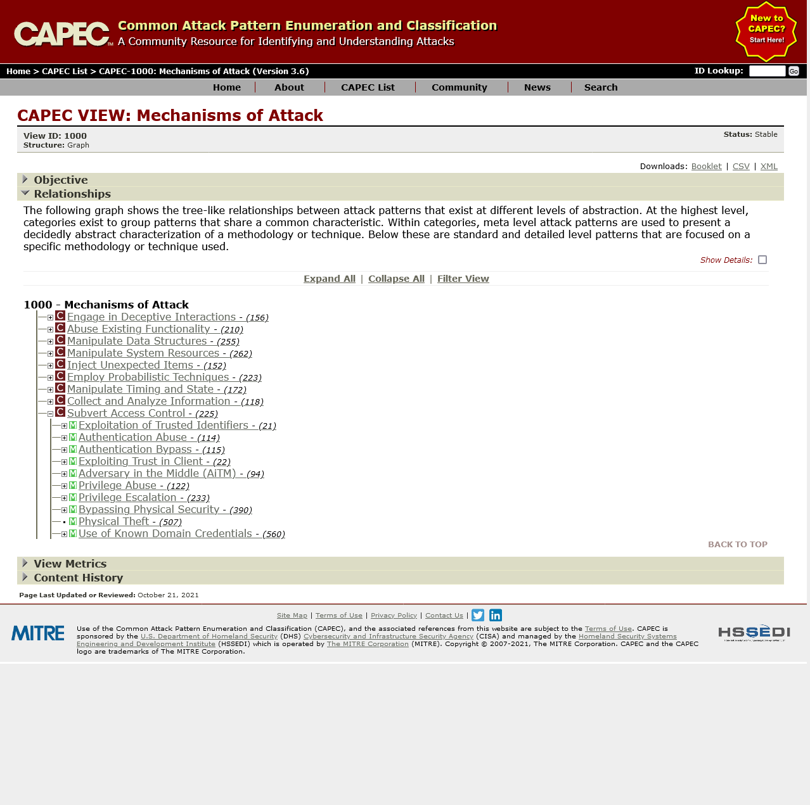

# CAPEC CAWE CWE

## Traversing CAPEC
The first step to using this methodology consists of going to the CAPEC website found at [capec.mitre.org](https://capec.mitre.org/). The starting page should look something look the following:

On the website, there are currently 2 main "views" within CAPEC: mechanisms of attack or domains of attack (see left side, "CAPEC List Quick Access").
Linking this to the context model background, mechanisms focus more on threats in interaction between components whereas domains focus more on threats within entities themselves.
Clicking through to the desired view a collection of high level categories will be presented.
Expanding these show individual threats.
These individual threats are of interest in this step.

Clicking one will result in the following image.
**image capec example**
it lists a description, relationships, prerequisites, mitigation and occasionally weaknesses.

### Interpreting C(A)WEs
Pictures: CAPEC website
