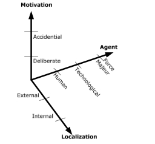

# Technique: OSA

Typically, identifying threat actors is an overlooked element in threat modeling.
It doesn't tend to be an explicit step in threat identification and at best is implicitly done during context modeling.
However, taking time to do more explicit identification of threats definitely can have a positive effect on providing a more holistic overview of threats.
They help to refine the context model as well as can be used when judging impact and feasibility of specific threats.

In this section OSA's (Open Security Architecture) threat actor model will be explored.
OSA is a world-wide recognized open source community which publishes security controls and patterns.

## The OSA Threat Catalogue

The OSA threat catalogue is made up of sub-spaces in 3 orthogonal dimensions which are modeled as seen on the diagram
Threat actors fit into a point on this 3-dimensional space.
The motivation vector defines 2 spaces: accidental and deliberate actors.
The localization vector also defines 2: the external and internal actors.
The agent vector defines 3 sub-spaces: human actor, technological actor and force majeur actors.

### Motivation dimension
The motivation dimension 

### Localization dimension

### Force Majeur dimension
The force majeur dimension defines what kind of agent the actor is.
In a way, in what kind of universe it's understood to exist, the sub-spaces make this a bit more clear.
The human agent is as one would expect any kind of human actor such as users, attackers, APTs, etc.
A technological agent creates threats that are tied to physical or chemical processes.
OSA uses as an example aging processes.
Finally, a force majeur actors are predominately environment-like such as tropical storms, earthquakes, water, etc.

## Shortcomings

Introduce relational dimension: Internal, Supplier, Unknown

## Example Table
**insert table example**

## Conclusion

As seen, threat actors are important tools for model refinement.
This will be of particular use later when judging impact and feasibility of threats in threat identification. 
On another note, threat actors could also be used on their own as starting points for a more freestyle technique of threat identification "what could a deliberate external actor do to the system architecture?"
